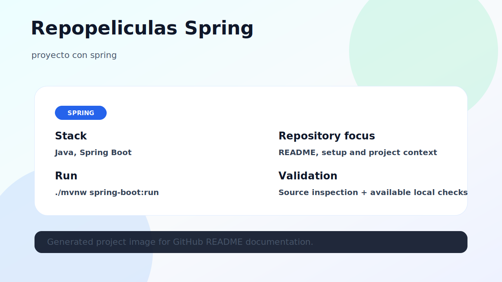

# Repopeliculas Spring

proyecto con spring



## Stack

- Java
- Spring Boot

## What this repository contains

This repository contains the source code and documentation for **repopeliculas-spring**. The README was refreshed to make the project easier to understand, run and validate from GitHub.

## Project image

The image above represents the current project state. When a local browser runtime was available, it was captured from the running project; otherwise it is an honest architecture/overview image based on source inspection.

## Getting started

```bash
git clone https://github.com/luisMakesIt/repopeliculas-spring.git
cd repopeliculas-spring
```

### Install dependencies

```bash
./mvnw test  # or mvn test when no wrapper exists
```

### Run locally

```bash
./mvnw spring-boot:run
```

## Available scripts / commands

| Command | Description |
| --- | --- |
| — | No package scripts detected |

## Validation notes

- Maven could not run in this environment; source inspection used instead.

## Suggested next improvements

- Add automated tests or CI if the project does not have them yet.
- Keep environment-specific values out of version control.
- Document any external services required to run the project locally.
